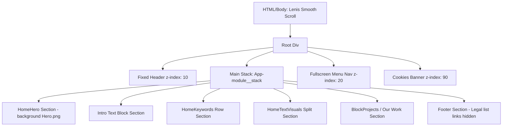

# Alpinaire Layout Architecture

This document defines the layout grids, positioning schemes, layer hierarchies (z-index), scrolling mechanics, and responsive reflow specifications of the Alpinaire site.

---

## 1. Global Page Structure

The homepage is structured as a vertical sequence of block level modules wrapped in a root layout container:

*(Note: The `LegalNotice` overlay at `z-index: 100` resides in the DOM but has been disabled and hidden from the layout flow via `display: none !important`).*

---

## 2. Flex & Grid Layout Structures

### A. The Structural Stack (`main.App-module__stack`)
The page wraps flow components in a CSS stack using Flexbox alignment (`display: flex; flex-direction: column; width: 100%;`). There are no complex side-by-side main container layouts; rather, full-width sections stack strictly down the viewport.

### B. Navigation Header Bar (`Header-module__wrapper`)
*   **Layout Scheme:** Flexbox.
*   **CSS Properties:**
    *   `display: flex`
    *   `justify-content: space-between` (Pushes menu to far left, CTA to far right, centering the logo background-image frame)
    *   `align-items: center`
    *   `position: fixed; top: 0; left: 0; width: 100%;`
    *   **Z-Index:** `10` (Guarantees header remains visible above all standard page content sections)

### C. Projects Grid (`ProjectsGrid-module__list`)
*   **Layout Scheme:** CSS Grid layout on desktop.
*   **CSS Properties:**
    *   `display: grid`
    *   `grid-template-columns: repeat(12, 1fr)` (Or typical custom fractional grid layout where Cards occupy split segments)
    *   `gap: 24px` (Desktop grid gap)
*   **Flow Breakdown:**
    *   Card 1 (No. 054): Landscape aspect ratio. Spans columns 1–6 (left side).
    *   Card 2 (No. 318): Landscape aspect ratio. Spans columns 7–12 (right side).
    *   Card 3 (No. 042): Portrait aspect ratio. Spans centered columns (typically centered 3–10 or similar offset columns on desktop).

### D. Footer Structure (`Footer-module__wrapper`)
*   **Layout Scheme:** Flexbox or grid depending on screen width.
*   **Flex Rows:**
    *   `Footer-module__navigation` wrapping links.
    *   `Footer-module__socials` wrapping Instagram, LinkedIn, and Newsletter links.
    *   `LegalInfos-module__root` representing copyright and disclaimer notices (note: the navigation lists inside `.LegalInfos-module__list` are stripped via `.LegalInfos-module__list__mTmYH { display: none !important; }`).

---

## 3. Z-Index Layering Strategy

To manage overlays and interactive popups, a strict z-index scale is established:

| Layer / Element | Position Scheme | Z-Index Value | Purpose |
| :--- | :--- | :--- | :--- |
| **Normal Page Flow** | Static / Relative | `auto` / `0` | Standard sections, videos, intro paragraphs, grids |
| **Header Bar** | Fixed | `10` | Top branding header (remains visible during scrolling) |
| **Menu Overlay** | Fixed | `20` | Fullscreen menu navigation panel (covers header backdrop) |
| **Cookies Consent** | Fixed | `90` | Bottom floating banner (above menu backings) |
| **Legal Notice Popup** | Fixed | **DISABLED** | Modal backdrop disabled/hidden from active flow (`display: none`) |

---

## 4. Scroll snapping & Smooth Scrolling

The site utilizes **Lenis** smooth scrolling on the body node, which is indicated by:
*   Classes appended to the HTML element: `class="lenis lenis-stopped"` or `class="lenis lenis-smooth"`.
*   Body scrolling is intercepted to execute inertia-driven animations.
*   Background image/video elements (e.g. within the Hero or ProjectCard media containers) use a subtle **parallax scale transition**, shifting vertical translation (`translate3d(0px, -10%, 0px) scale(1.15)`) relative to viewport scroll progress, producing a premium fluid movement effect.

---

## 5. Responsive Reflow Specifications

The layout is optimized mobile-first to ensure pixel-perfect fidelity:

*   **Desktop (1440px):** Multi-column layout grids, high paddings, side-by-side landscape project grids, horizontal footer nav items.
*   **Tablet (768px):** Gaps reduce. Header paddings contract. Main typography scales down slightly. Project cards resize matching fluid width.
*   **Mobile (390px):**
    *   Header: Logo size is set to `width: 94rem` or `height: 94rem` (using PNG backdrop). CTA button slides to fit phone width.
    *   Projects Grid: Grid reflows to `grid-template-columns: 1fr` (strict vertical stack of project cards). All cards become full bleed or 100% width of the screen.
    *   Footer: Flex rows stack vertically, wrapping links inside neat block arrays.
    *   Keywords: Media row expansions fill viewport width completely.
